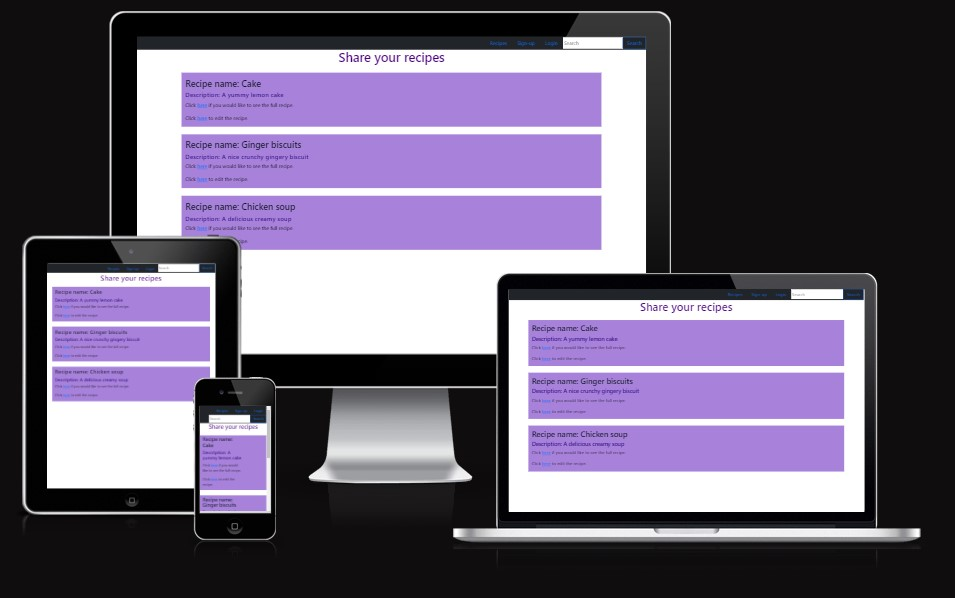

# Recipe Share
Recipe share is a website to keep and share your favourite recipes, which uses the Code Institute mock terminal on Heroku to run. 

Users can look at recipes and decide what they like. They can ass their own recipes, edit if there are any changes and delete if 
they no longer want to change it. 

https://fun-recipe.herokuapp.com/

### User stories
 * The user will be able to look at and search for recipes. 
 * The user will be able to edit the recipe if they have made errors or need to make changes. 
 * The user will be able to delete the recipes when they no longer want to share it. 
 * The user will be able to sign-up, login and logout when needed. 
 * The user author will be the only one who can edit and delete their recipe.

## How to use the app
 * The user reads the recipes without logging in. 
 * When they have logged in they will be able to add their own recipes. 

## Features
 *  Users need can find recipes online. 
 * A nice place for the user to store their recipes. 

 ## Testing
 
 ### User story testing
 * The user is able to search for recipes. 
 * The user is able to edit the recipe if they have made errors or need to make changes. 
 * The user is able to delete the recipes when they no longer want to share it. 
 * The user can sign-up, login and logout when needed. 
 * The user author is the only one who can edit and delete their recipe.

## Bugs
### Solved Bugs

### Remaining Bugs

### Validator Testing

## Deployment
This project was deployed early using Code Institute's mock terminal for Heroku
 #### Steps for early deployment:
  * Start by making a database using ElephantSQL. 
  * Then create a new Heroku app. 
  * Click on settings and Go to Convig Vars
  * Set Key to Port and Value to 8000. 
  * Then add my SECRET_KEY - same SECRET_KEY used on env.py
  * Then add DISABLE_COLLECTSTATIC for early deployment
  * Click on Deploy at top of page. 
  * Change Deployment method to GitHub. 
  * Connect to GitHub and add repository recipe. 
  * Check if manual deploy is on main otherwise set to main. 
  * Click on Deploy Branch
 #### Steps for final deployment:
  * Start by making a database using ElephantSQL. 
  * Then create a new Heroku app. 
  * Click on settings and Go to Convig Vars
  * S

## Credits
 * Code institute for the deployment terminal
 * Code institute Hello Django and I think before I blog.  
 