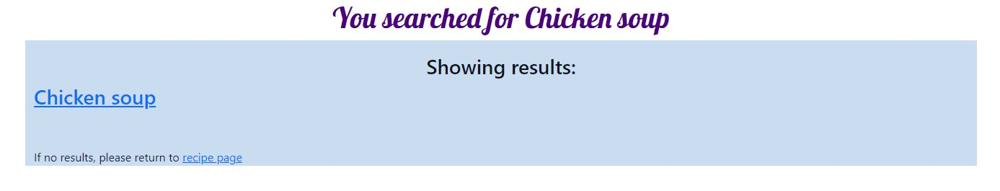
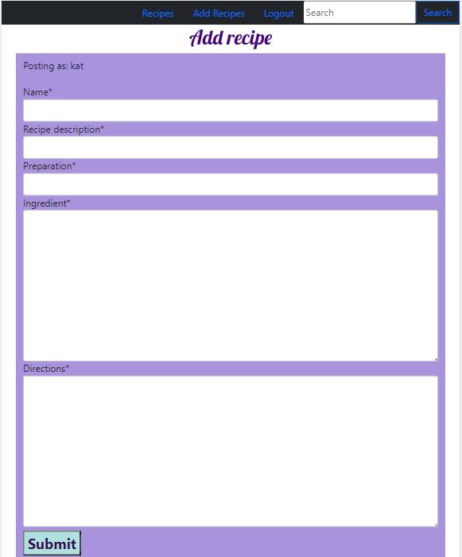

# Recipe Share
Recipe share is a website to keep and share your favourite recipes, which uses the Code Institute mock terminal on Heroku to run. 

Users can look at recipes and decide what they like. They can add their own recipes, read it,  edit if there are any changes and delete if 
they no longer want to change it. 

https://fun-recipe.herokuapp.com/

### User stories
 * The user will be able to look at and search for recipes. 
 * The user will be able to edit the recipe if they have made errors or need to make changes. 
 * The user will be able to delete the recipes when they no longer want to share it. 
 * The user will be able to sign-up, login and logout when needed. 
 * The user author will be the only one who can edit and delete their recipe.

## How to use the app
### Before login

 * The user will be able to see the name and a basic description of the recipe on the home page

 * The user will be able to search for the type of recipe they would like. 
 
 

 * When the user clicks on here to see the recipe, they will be taken to the full recipe.
 * While logged out they wont be able to add, delete or edit recipes. 

### Signing up

 * The user is able to sign up. 
 * The user must give their username and make a password, which they will need to confirm. 
 

 
### Logout and login

 * The user is able to logout and login when needed.
 

 

### When the user is logged in 
 * When the user is logged in they are able to add their own recipes and share it with others. 
 

  
 * Only the author of the recipe will see the edit and delete buttons. 
 
 
   
  * The author will be able to update their recipes when needed. 
   
 

* The author will be able to delete their recipes if they no longer wish to share it. 

   
## Features
 *  Users need can find recipes online. 
 * A nice place for the user to store their recipes. 

 ## Testing
 
 ### User story testing
 * The user is able to search for recipes. 
 * The user is able to edit the recipe if they have made errors or need to make changes. 
 * The user is able to delete the recipes when they no longer want to share it. 
 * The user can sign-up, login and logout when needed. 
 * The user author is the only one who can edit and delete their recipe.

## Bugs
### Solved Bugs
 * When I deployed my app my css was not deploying with it. 
  * I had not remove disable_collect static. Once I removed this it worked. 
 
### Remaining Bugs
 * There are no remaining bugs. 

### Validator Testing
 * By running my project through lighthouse in devtool, I confirmed that the colours and fonts are easy to read and accessible. 
 * CSS
   * No errors were found when running the css code through jigsaw W3C code validator
 * HTML
   * No errors were found when running the html code through validator W3
* Python
  * Ran linter in gitpod recipe, had 2 long lines in settings which were imported when I installed django. 
  * Ran automated testing using tests.py = test_views, test_models and test_forms  
* Accessibility
  * By running my project through lighthouse in devtool, I confirmed that the colours and fonts are easy to read and accessible. 

## Deployment
This project was deployed early using Code Institute's mock terminal for Heroku
 #### Steps for early deployment:
  * Start by making a database using ElephantSQL. 
  * Then create a new Heroku app. 
  * Click on settings and Go to Convig Vars
  * Set Key to Port and Value to 8000. 
  * Then add my SECRET_KEY - same SECRET_KEY used on env.py
  * Then add DISABLE_COLLECTSTATIC for early deployment
  * Click on Deploy at top of page. 
  * Change Deployment method to GitHub. 
  * Connect to GitHub and add repository recipe. 
  * Check if manual deploy is on main otherwise set to main. 
  * Click on Deploy Branch
 #### Steps for final deployment:
  * Change Debug to False
  * git add . git commit -m and git push your code to github
  * Click on settings and Go to Convig Vars
  * Remove Disable_collectstatic
  * Go to Deploy at the top of your page. 
  * Once in Deploy go to the bottom and click on Deploy Branch. 
  * View you build log. 
  * Once the app has launched wait 30 seconds and open your app. 

## Credits
 * Code institute for the deployment terminal
 * Code institute Hello Django and I think before I blog. 
 * https://docs.djangoproject.com
 * https://learn.microsoft.com/en-us/aspnet/web-api/overview/testing-and-debugging/unit-testing-controllers-in-web-api
 * Codemy - Create a search bar. 
 * https://docs.djangoproject.com
 * https://learn.microsoft.com/en-us/aspnet/web-api/overview/testing-and-debugging/unit-testing-controllers-in-web-api
 * https://simpleisbetterthancomplex.com/tutorial/2016/08/03/how-to-paginate-with-django.html
 * CodingEntrepreneurs - Try django 
 * The Dumbfounds - Django testing tutorial
 * https://getbootstrap.com/docs/5.2/getting-started/introduction/
 * Dom Vacchiano - Django tutorial for beginners/Django full stack
 
